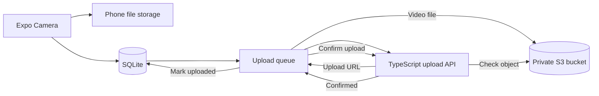

# SelfieMagic

SelfieMagic is an Android app for recording and uploading worker videos. It is built with Expo SDK 54 and TypeScript.

The app also works without an internet connection. It saves each video and its details on the phone first. When the phone is online, it uploads waiting videos to a private Amazon S3 bucket.

## What you need

- Node.js 20.6 or newer
- npm
- Android Studio and the Android SDK
- An Android 10 or newer phone or emulator for testing
- An AWS account and access to an S3 bucket
- An Expo account and EAS CLI to build the APK

The project uses Expo SDK 54, React Native 0.81, and TypeScript 5.9. Expo SDK 54 supports Android API 24 and newer. We test this project against API 29 and newer.

## Folder layout

```text
src/
  components/       Camera buttons and other shared UI
  db/               SQLite schema, migrations, and queries
  hooks/            Camera recording logic
  navigation/       App navigation
  screens/          App screens
  services/         Login, network, upload, and sync logic
  storage/          Local key-value storage
  types/             Shared TypeScript types
backend/
  src/               TypeScript upload API
infra/terraform/     S3 and IAM setup
docs/                Design notes and Android test results
```

## Environment variables

The root [`.env.example`](.env.example) lists all environment variables used by the project.

```powershell
Copy-Item .env.example .env
Copy-Item backend/.env.example backend/.env
```

When using a real phone, set `EXPO_PUBLIC_UPLOAD_API_URL` to your computer's local network address. For example:

```text
http://192.168.0.156:3001
```

Do not use `localhost` on a phone. On the phone, `localhost` means the phone itself.

`ALLOW_CLEARTEXT_TRAFFIC=true` allows local HTTP traffic in development and preview builds. Production builds should use HTTPS and keep this setting false.

Do not add AWS access keys to either `.env.example` file. The backend uses the normal AWS credential chain.

## Run the app

Install the packages and check the TypeScript code:

```powershell
npm install
npm run typecheck
```

Start Expo:

```powershell
npx expo start
```

## Run the backend

Fill in `backend/.env`, then run:

```powershell
Set-Location backend
npm install
npm run typecheck
npm start
```

The backend has two routes:

- `POST /uploads/presign` creates a short-lived S3 upload URL.
- `POST /uploads/confirm` checks that the video reached S3.

The sample backend accepts `workerId` from the app. A real production backend must read the worker ID from a verified login token instead.

## Build the Android APK

The `preview` EAS profile creates an installable APK.

```powershell
npm install --global eas-cli
eas login
eas build --platform android --profile preview
```

Install the downloaded APK and check the device API level:

```powershell
adb install -r path/to/selfiemagic.apk
adb shell getprop ro.build.version.sdk
```

The latest build details and file hash are in [`docs/ANDROID_TESTING.md`](docs/ANDROID_TESTING.md). A local copy is stored at `artifacts/SelfieMagic-1.0.0-preview.apk`. The `artifacts` folder is ignored by Git because APK files are large. EAS Build is used to share the APK.

## How it works



SQLite keeps the local video list and upload state. This means a poor connection or app restart does not lose the upload queue.

The backend does not receive the video file. It only creates an upload URL and checks the uploaded S3 object. The phone sends the video straight to S3. This keeps large video traffic away from the backend server.

## Database choices

The app has `workers` and `videos` tables. Database changes use `PRAGMA user_version` and run inside transactions. WAL mode helps the app read the video list while another part of the app writes upload updates.

The video list index is:

```sql
CREATE INDEX idx_videos_worker_started
ON videos(worker_id, started_at DESC, video_id DESC);
```

It lets the dashboard load videos for one worker in the right order. `video_id` keeps the order stable when two videos have the same timestamp.

The upload queue has a smaller partial index. It only contains pending and failed videos, because uploaded videos no longer need queue scans.

The full schema and index notes are in [`docs/TECHNICAL_DESIGN.md`](docs/TECHNICAL_DESIGN.md).

## AWS choices

Each environment gets one private S3 bucket. Videos use this key format:

```text
workers/{hashed_worker_id}/videos/{video_id}.mp4
```

The worker ID is hashed so an email address or phone number does not appear in the S3 path. The video UUID stays the same during retries, so a retry uses the same object key.

The phone never gets AWS credentials. It gets a short-lived upload URL for one file. After the upload, the backend checks the key, file size, and ETag before the app marks the video as uploaded.

Terraform sets up private access, encryption, versioning, HTTPS-only access, lifecycle rules, and a limited IAM role. See [`INFRA.md`](INFRA.md) for the full AWS notes.

## Retries and larger usage

The app saves the attempt count, last error, and last attempt time in SQLite. It waits 2, 4, 8, 16, 32, and 64 seconds between retries. An interrupted upload goes back to `pending` the next time the app starts.

At 10,000 workers, with 20 videos of 50 MB per worker each day, the system receives about 200,000 videos and 10 TB of data every day.

The first problem for a worker is usually phone storage or upload speed. Across the whole system, S3 storage cost is the biggest early concern. The sample one-process backend would also need authentication, monitoring, rate limits, and horizontal scaling before production use.

More detail is available in the technical design document.

## Checks

Run these before creating a build:

```powershell
npm run typecheck
npm --prefix backend run typecheck
npm --prefix backend run build
npx expo config --type public
```

To check the Terraform files, run `terraform fmt -check` and `terraform validate` from `infra/terraform`.
