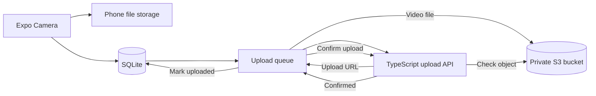

## Database Migration Strategy

Each phone has its own SQLite database. The backend handles data shared between users. The app uses `PRAGMA user_version` to track the database version. When the schema changes, the app runs migrations in order during startup. Each schema migration runs inside a transaction. If it fails, SQLite rolls back the whole change and keeps the old database working.

For example, this is how we would add `gps_accuracy` to a database with 50,000 video rows:

1. We will add a nullable column without a default value:

   ```sql
   ALTER TABLE videos ADD COLUMN gps_accuracy REAL;
   ```

2. Existing rows will contain `NULL`. This means GPS accuracy was not recorded or has not been copied yet. Adding the column this way avoids rewriting all 50,000 rows during startup.

3. We can update the recording code so every new video saves `gps_accuracy`.

4. We will copy old GPS accuracy values from `metadata_json` in batches of 500:

   ```sql
   UPDATE videos
   SET gps_accuracy = json_extract(metadata_json, '$.gps_at_start.accuracy')
   WHERE video_id IN (
      SELECT video_id
      FROM videos
      WHERE gps_accuracy IS NULL
      LIMIT 500
   );
   ```

5. We can run each batch in a short transaction. Pause between batches so recording and uploading stay responsive. Save the progress in a migration-state table so the work can continue after the app or phone restarts.

6. We will add an index only if the app searches or sorts by `gps_accuracy`. Otherwise, the index would use storage and make writes slower without helping any query.

We will test every migration with a new database and copies of databases from older app versions. One test database will contain 50,000 video rows.

The tests will check the schema version, row count, saved metadata, restart recovery, and rollback behavior.

For a destructive change, we will first add the new table or column. We will copy the data in small batches, update the app to use the new structure, and remove the old structure in a later release.

## Query Optimization

The video list uses keyset pagination instead of `OFFSET`. After loading the first page, the app uses the last video's `started_at` and `video_id` values to load the next page:

```sql
SELECT video_id, worker_id, started_at, duration_ms, file_size_bytes,
       fps, fps_tier, upload_state
FROM videos
WHERE worker_id = ?
  AND (started_at < ? OR (started_at = ? AND video_id < ?))
ORDER BY started_at DESC, video_id DESC
LIMIT ?;
```

<<<<<<< Updated upstream
This query is supported by the following index:
=======
## Environment variables

The root [`.env.example`](.env.example) lists all environment variables used by the project.

```powershell
Copy-Item .env.example .env
Copy-Item backend/.env.example backend/.env
```

When using a real phone, set `EXPO_PUBLIC_UPLOAD_API_URL` to your computer's local network address. For example:

```text
http://192.168.0.156:3001
```

Do not use `localhost` on a phone. On the phone, `localhost` means the phone itself.

`ALLOW_CLEARTEXT_TRAFFIC=true` allows local HTTP traffic in development and preview builds. Production builds should use HTTPS and keep this setting false.

`EXPO_PUBLIC_MAX_RECORDING_DURATION_SECONDS` sets the recording limit. It defaults to 60 seconds and accepts values from 1 to 600.

Do not add AWS access keys to either `.env.example` file. The backend uses the normal AWS credential chain.

## Run the app

Install the packages and check the TypeScript code:

```powershell
npm install
npm run typecheck
```

Start Expo:

```powershell
npx expo start
```

## Run the backend

Fill in `backend/.env`, then run:

```powershell
Set-Location backend
npm install
npm run typecheck
npm start
```

The backend has two routes:

- `GET /health` confirms that the phone can reach the API.
- `POST /uploads/presign` creates a short-lived S3 upload URL.
- `POST /uploads/confirm` checks that the video reached S3.

The sample backend accepts `workerId` from the app. A real production backend must read the worker ID from a verified login token instead.

Keep the backend running while testing uploads. From the phone, open `http://YOUR_COMPUTER_IP:3001/health`. It should show `{"ok":true}`. If it does not, check that the phone and computer use the same Wi-Fi, the IP in `.env` is current, and Windows Firewall allows Node.js on the private network. Rebuild the APK after changing an `EXPO_PUBLIC_` value because Expo adds it to the app bundle at build time.

## Build the Android APK

The `development` profile creates an installable development/debug APK. It includes Expo Dev Client and needs a Metro server while you use the app.

```powershell
npm install --global eas-cli
eas login
eas build --platform android --profile development
npx expo start --dev-client
```

Use the `preview` profile when you need a standalone APK that runs without Metro:

```powershell
eas build --platform android --profile preview
```

Install the downloaded APK and check the device API level:

```powershell
adb install -r path/to/selfiemagic.apk
adb shell getprop ro.build.version.sdk
```

The latest build details and file hashes are in [`docs/ANDROID_TESTING.md`](docs/ANDROID_TESTING.md). Local copies are stored in `artifacts/`. The folder is ignored by Git because APK files are large. EAS Build is used to share them.

## How it works



SQLite keeps the local video list and upload state. This means a poor connection or app restart does not lose the upload queue.

The backend does not receive the video file. It only creates an upload URL and checks the uploaded S3 object. The phone sends the video straight to S3. This keeps large video traffic away from the backend server.

## Database choices

The app has `workers` and `videos` tables. Database changes use `PRAGMA user_version` and run inside transactions. WAL mode helps the app read the video list while another part of the app writes upload updates.

### Example migration for 50,000 videos

Suppose an app update needs a new `gps_accuracy` column and the phone already has 50,000 video rows.

1. Add the column as nullable, without a default value:

   ```sql
   ALTER TABLE videos ADD COLUMN gps_accuracy REAL;
   ```

   SQLite can add this column without rewriting every old row. New recordings can start filling it immediately.

2. Add a small migration progress table. Save the migration name, the last processed `video_id`, and whether the work is complete.

3. Copy old values from `metadata_json` in batches of 500:

   ```sql
   UPDATE videos
   SET gps_accuracy = json_extract(metadata_json, '$.gps_at_start.accuracy')
   WHERE video_id IN (
     SELECT video_id
     FROM videos
     WHERE gps_accuracy IS NULL
       AND video_id > ?
     ORDER BY video_id
     LIMIT 500
   );
   ```

4. Run each batch in a short transaction and save its progress in the same transaction. Pause between batches so recording and the upload queue stay responsive.

5. If the app closes, continue from the saved `video_id` on the next start. A failed batch rolls back without losing the earlier completed batches.

6. Test the migration with a new database, each older schema version, and a copy containing 50,000 rows. Check row counts, null handling, JSON values, restart recovery, and transaction rollback.

An index on `gps_accuracy` should only be added if the app starts filtering or sorting by it. Otherwise, the index would take space and slow down writes without helping a query.

The video list index is:
>>>>>>> Stashed changes

```sql
CREATE INDEX idx_videos_worker_started
ON videos(worker_id, started_at DESC, video_id DESC);
```

This index first finds videos for one worker and then reads them in the correct order. `video_id` gives a stable order when two videos have the same start time. With `OFFSET`, SQLite must read and skip all earlier rows before returning a later page. Keyset pagination starts from the last loaded video, so later pages stay fast as the table grows. It also reduces skipped or repeated results when a new video is added while the list is open.

The upload worker uses a second partial index:

```sql
CREATE INDEX idx_videos_upload_queue
ON videos(upload_state, last_attempted_at, started_at)
WHERE upload_state IN ('pending', 'failed');
```

This partial index contains only videos that still need upload work. It stays smaller than an index over every video and helps the app quickly find pending or failed uploads in retry order. Already uploaded videos do not need to be scanned.

## Upload and Sync Engine

The upload queue is stored in SQLite, so it is not lost when the app or phone restarts.

### Upload Flow

1. A completed recording is saved to the phone and inserted into SQLite with the `pending` state.
2. The sync engine checks that the internet is available.
3. It changes one row from `pending` to `uploading`. This update is conditional, so the same video cannot be claimed twice.
4. The app sends `video_id`, `worker_id`, file size, and content type to `POST /uploads/presign`.
5. The backend creates a 15-minute presigned S3 PUT URL for that video.
6. The app uploads the local file directly to S3.
7. The app calls `POST /uploads/confirm` with the object key, file size, and ETag.
8. The backend checks the object with S3 `HeadObject`. Only then does the app change the row to `uploaded`.

The network type used for each attempt is saved as `wifi`, `cellular`, `none`, or `unknown`.

### Upload States

- `pending`: The video is waiting for its first attempt or next retry.
- `uploading`: The app has claimed the video and is uploading it.
- `uploaded`: S3 has confirmed the object. Code only allows this state to be set from `uploading`, and it never moves back to `pending`.
- `failed`: The video reached the maximum number of attempts. The user can retry it manually.

### Retry and Restart Handling

The app retries failed attempts after 2, 4, 8, 16, 32, and 64 seconds. After the seventh failed attempt, the row changes to `failed`. The attempt count, last error, and last attempt time are stored in SQLite, so the delay still works after an app restart.

If the app closes during an upload, the next launch changes the unfinished `uploading` row back to `pending`. The next attempt uploads the file from the beginning, as required.

### Idempotency

`video_id` is a UUID created when recording starts. It is also used as the API idempotency key and as part of the S3 object key:

```text
workers/{hashed_worker_id}/videos/{video_id}.mp4
```

This gives one stable S3 key for each video. Before issuing another URL, the backend checks whether that object already exists with the expected size. This handles the case where the PUT succeeded but the app closed before saving the `uploaded` state. The existing object is confirmed instead of uploading a duplicate.

### Local Backend Setup

The example backend is in `backend/`. It uses the AWS SDK to create scoped presigned URLs and confirm uploaded objects.

<<<<<<< Updated upstream
```sh
cd backend
npm install
# macOS/Linux: cp .env.example .env
# Windows: Copy-Item .env.example .env
npm start
=======
## Retries and larger usage

The app saves the attempt count, last error, and last attempt time in SQLite. It waits 2, 4, 8, 16, 32, and 64 seconds between retries. An interrupted upload goes back to `pending` the next time the app starts.

The recorder reads frame count, track duration, width, and height from the finished MP4. It uses these values for FPS and resolution. If a device creates an MP4 that cannot be parsed, the metadata clearly records that it used the requested 1080p/30 FPS camera profile as a fallback.

Crash-safe recovery for an interrupted camera recording is not part of the current app. The production approach is documented in [`docs/TECHNICAL_DESIGN.md`](docs/TECHNICAL_DESIGN.md): use a database recording session, write to a `.partial` file, scan unfinished work at startup, recover valid MP4 files, and quarantine broken files without creating duplicate video IDs.

At 10,000 workers, with 20 videos of 50 MB per worker each day, the system receives about 200,000 videos and 10 TB of data every day.

The first problem for a worker is usually phone storage or upload speed. Across the whole system, S3 storage cost is the biggest early concern. The sample one-process backend would also need authentication, monitoring, rate limits, and horizontal scaling before production use.

More detail is available in the technical design document.

## Checks

Run these before creating a build:

```powershell
npm run typecheck
npm --prefix backend run typecheck
npm --prefix backend run build
npx expo config --type public
>>>>>>> Stashed changes
```

Set valid AWS credentials in the shell or use an IAM role. Set `AWS_REGION` and `S3_BUCKET` in `backend/.env`.

Copy the root `.env.example` to `.env` and set `EXPO_PUBLIC_UPLOAD_API_URL`. When testing on a physical phone, use the computer's LAN address, such as `http://192.168.1.10:3001`. The phone cannot reach the computer through `localhost`.

The example backend accepts the mock `worker_id` from the request. A production backend must verify the login token and take `worker_id` from the verified server-side session, not trust a worker ID sent by the app.

