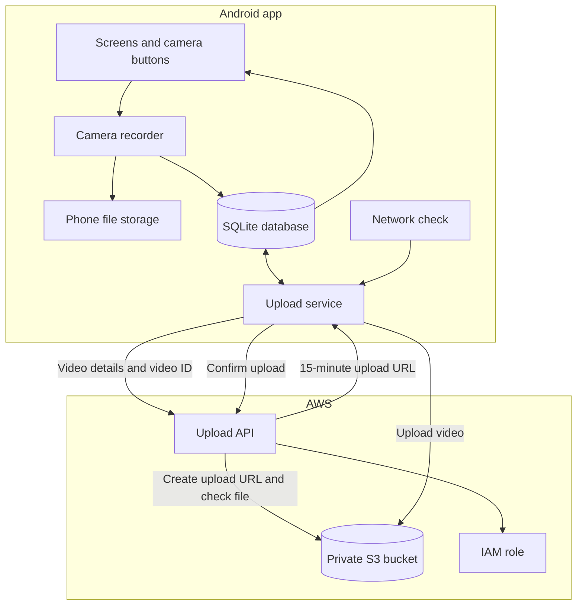
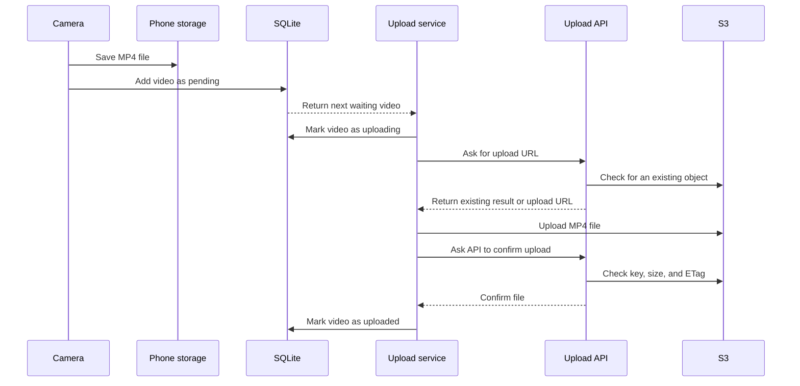

# SelfieMagic Technical Design

This document explains how the Android app, local database, upload API, and Amazon S3 work together. With normal margins and a 10 to 12 point font, it should fit into about two to four pages.

## 1. Main parts of the system

SelfieMagic can record videos when the phone is offline. The phone handles recording, saves the video details, and keeps its own upload queue. The backend gives the app permission to upload one video and checks that the upload reached S3.



The source code is split by job. `screens/` contains the app pages. `services/` contains login, network, and upload code. `db/` contains the SQLite schema and queries.

SQLite is used because the upload queue must survive an app restart. It also gives us transactions and indexes, which are useful when two parts of the app try to read or update upload state at the same time. The app and backend are both written in TypeScript.

## 2. From recording to S3



The app creates a UUID when recording starts. After recording finishes, it saves the MP4 file and adds a row to SQLite with the state `pending`.

The upload service runs while the app is open and when the network changes. It marks one pending row as `uploading` before it starts. This update has a condition, so the same app process cannot claim the row twice.

The backend creates a short-lived upload URL. The phone then sends the video straight to S3. The backend never has to receive or hold the large video file.

If an upload is interrupted, the current version starts the file again from the beginning. This keeps the code simple and matches the current 50 MB file size assumption. Multipart upload would help with much larger videos, but it would also require the app to save each uploaded part and clean up unfinished uploads.

## 3. Database design

The `workers` table stores the worker ID and created/updated times.

The `videos` table stores:

- Video and worker IDs
- Start and end times
- Duration and file size
- Frame rate and frame-rate tier
- Device model and Android version
- Resolution and local file path
- Extra metadata as JSON
- Upload state, attempt count, last error, and last attempt time
- Network type used for the upload
- Upload and local deletion times

The schema rejects negative durations and file sizes. It also limits upload state to `pending`, `uploading`, `uploaded`, or `failed`. The local file path is unique. A foreign key connects each video to a worker.

The app turns on foreign keys and WAL mode. WAL mode makes it easier to read the dashboard while an upload update is being written.

Database versions use `PRAGMA user_version`. Each migration runs in a transaction. If a migration fails, SQLite rolls it back. For a large database, new columns should first be nullable so the app does not need to rewrite every old row during startup.

The app uses two indexes:

```sql
CREATE INDEX idx_videos_worker_started
ON videos(worker_id, started_at DESC, video_id DESC);

CREATE INDEX idx_videos_upload_queue
ON videos(upload_state, last_attempted_at, started_at)
WHERE upload_state IN ('pending', 'failed');
```

The first index helps the dashboard load one worker's newest videos. `video_id` gives a fixed order when two rows have the same start time. The dashboard uses the last row from one page to find the next page. This stays faster than skipping a large number of rows with `OFFSET`.

The second index only stores videos that may need upload work. Uploaded videos are left out, so the index stays small. We should only add more indexes when a real query needs them, because every index takes storage and adds work when a row changes.

## 4. AWS design

Each environment gets its own private S3 bucket. For example, development and production do not share a bucket. This lowers the chance of development code changing production data.

S3 object keys look like this:

```text
workers/{hashed_worker_id}/videos/{video_id}.mp4
```

The worker ID is hashed because it may be an email address or phone number. Personal information should not appear in an S3 path. The video ID is a UUID and does not change when an upload is retried.

The app never receives AWS keys. The backend uses an IAM role to create an upload URL for one object. The URL lasts for 15 minutes. This is long enough for a normal 50 MB upload but short enough to limit the risk if the URL is exposed.

The Terraform files make the bucket private, turn on encryption and versioning, block non-HTTPS traffic, and add lifecycle rules. The backend role only gets the S3 access it needs.

After an upload, the backend checks the exact S3 key, file size, and ETag when one is available. At a larger scale, S3 events should also go to SQS. A worker can then check every uploaded object even if the phone closes before it gets a reply. Failed SQS messages should go to a dead-letter queue for review.

In production, the backend must verify a login token and get the worker ID from that token. It must not trust a worker ID sent by the app.

## 5. Retries and duplicate uploads

The app saves every upload attempt in SQLite. Retry waits are 2, 4, 8, 16, 32, and 64 seconds. After the seventh failed attempt, the video changes to `failed`. The user can then start another retry by hand.

If the app closes during an upload, it may leave a row as `uploading`. On the next start, the app changes that row back to `pending`.

The `video_id` is also sent as the `Idempotency-Key` request header. The backend checks that the header and body contain the same ID. The same ID is part of the S3 key.

Before creating a new upload URL, the backend checks whether the object already exists. If the key and size match, it tells the app that the video is already uploaded. This handles a common case where S3 received the file but the app closed before saving the result.

A production version should not retry every error. Bad input and failed login checks should stop immediately. Network errors, rate limits, and server errors can be retried. A small random delay should also be added so thousands of phones do not retry at exactly the same time.

## 6. What happens at 10,000 users

Assume 10,000 workers record 20 videos each day and every video is 50 MB. That is about 200,000 videos and 10 TB of new data per day.

The first limits are likely to be:

1. **Phone storage and internet speed.** One worker creates about 1 GB each day. A phone that stays offline for several days needs a lot of free space. The app may need a storage limit, a Wi-Fi-only option, a clear queue warning, and automatic local cleanup after a confirmed upload.
2. **S3 cost.** S3 can handle this number of uploads, but storing hundreds of terabytes every month is expensive. Video quality, retention time, and lifecycle rules need to be agreed before launch.
3. **The sample backend.** The current backend is one Node.js process. It has mock login handling and no rate limits, monitoring, or backup instance. A production version should run more than one copy behind a load balancer or API Gateway.
4. **Upload tracking.** The phone should not be the only source of upload status. S3 events, SQS, alerts, and a dead-letter queue are needed to find missing or stuck work.
5. **Shared reporting data.** SQLite is right for one phone, but it cannot answer questions across all workers. A managed backend database will be needed for shared video records, reports, and retention jobs. The videos themselves should remain in S3.

S3 upload speed is not likely to be the first server problem because phones upload directly to S3. Phone connections, storage cost, login security, and monitoring need attention first.
